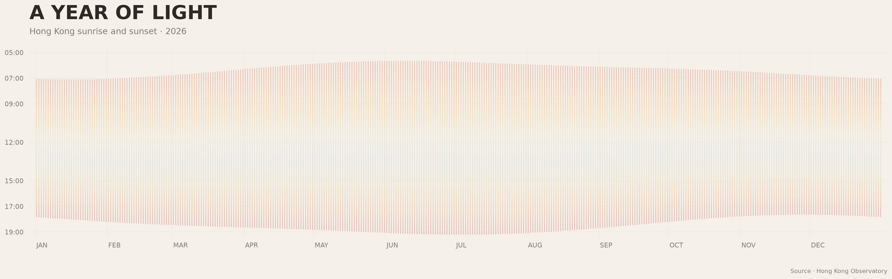
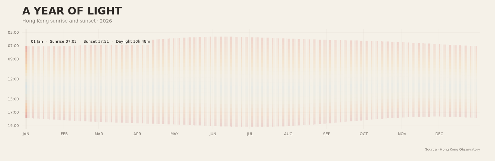

# A Year of Light

**A Year of Light** is a data visualisation of sunrise and sunset times in Hong Kong throughout 2026.

I chose this phenomenon because the change in daylight is difficult to notice from one day to the next, but becomes much clearer when an entire year is viewed together. Instead of using a conventional line chart, I wanted to turn each day into a small visual unit and let the accumulation of 365 days reveal the annual rhythm of daylight.

## Data Source

The data comes from the Hong Kong Observatory (HKO) open data service.

Source:  
https://data.weather.gov.hk/weatherAPI/opendata/opendata.php?dataType=SRS&year=2026&rformat=csv

The original dataset is stored locally as:

`data/Sun_rise_set_2026.csv`

It contains 365 daily records for the year 2026. Each row includes:

- `YYYY-MM-DD` — date
- `RISE` — sunrise time
- `TRAN.` — solar transit time
- `SET` — sunset time

The time values are provided in hours and minutes.

## Visualisation



Each vertical line represents one day.

The horizontal position shows the date across the year. The upper end of each line represents sunrise, while the lower end represents sunset. Because of this, the length of the line directly represents the amount of daylight on that day.

When all 365 days are placed next to each other, the gradual seasonal expansion and contraction of daylight becomes visible as a continuous shape.

A soft colour gradient is used within each daily line, moving from warm sunrise tones through pale daylight colours and back towards warmer sunset tones. These colours are an artistic interpretation of the changing atmosphere of daylight. They are not measurements of the actual colour of the sky.

## Animation

The project also includes a small animated version of the visualisation.



The full year remains visible in the background while one day is highlighted at a time. The highlighted day displays its date, sunrise time, sunset time, and total daylight duration.

The animation does not introduce new data. Instead, it makes it easier to read individual daily values while keeping them within the context of the full year.

## What the Visualisation Shows and Hides

The visualisation focuses on one relationship: how sunrise, sunset, and daylight duration change across the year.

It deliberately does not show weather conditions, cloud cover, temperature, brightness, or the actual observed colour of the sky. Although the original dataset also contains solar transit time, this value is not visualised in the final image.

This simplification allows the visualisation to keep one clear message: small daily changes accumulate into a visible annual rhythm of light.

## Run

Generate the static visualisation:

```bash
uv run plot.py